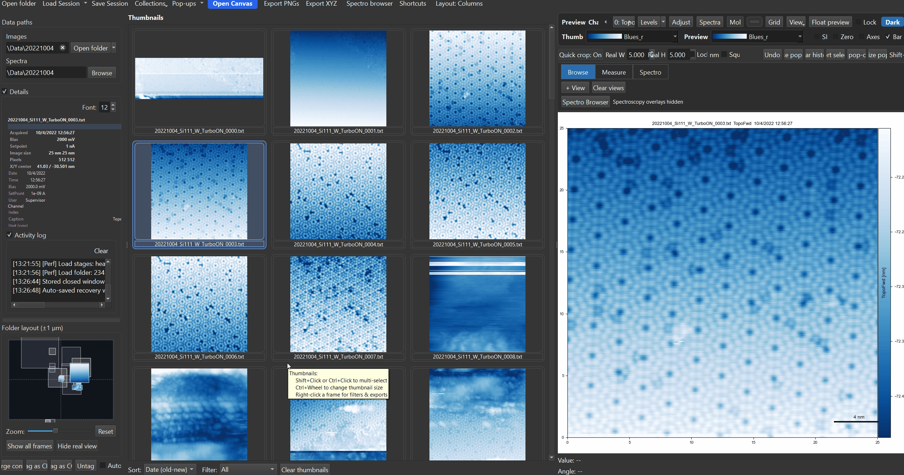

# First Steps

This page walks through a typical first session in SXM Viewer.

{ width="900" }

---

## 1. Open a folder

Click **Open folder** in the toolbar, or drag a folder onto the main window. The thumbnail grid fills with recognised images, and associated spectroscopy files are detected automatically when available.

See [Loading Data](../browsing/loading.md) for details.

---

## 2. Pick an image in the thumbnail grid

Click a thumbnail to load it into the **main preview**. The preview shows the active channel, colorbar, scale bar, and metadata panel.

Double-click a thumbnail to open it as a floating pop-out.

---

## 3. Switch channels

Use the preview **channel selector** or the previous/next channel arrows to move through topography, current, KPFM, and other acquired channels.

Each channel keeps its own display state, including contrast and colormap.

---

## 4. Try the core analysis tools

A good first pass is:

- press ++0++ to test **relative-zero** display
- turn **Crop template** on and click the preview to apply a fixed crop
- use ++shift++ + drag for a manual crop
- hold ++ctrl++ and click to draw a profile
- right-click and try **Apply filter**
- double-click the image to open a pop-out and compare workflows there

See [Preview & Popups](../image-analysis/preview-and-popups.md), [Cropping](../image-analysis/cropping.md), and [Profiles & Measurements](../image-analysis/profiles.md).

---

## 5. Save your work

When you have a useful working state, save it as either:

- a **Session** for a full folder-oriented workspace, or
- a **Collection** for a curated cross-folder set of images

See [Sessions & Collections](../browsing/sessions-and-collections.md).

---

## Suggested learning path

| Start here | Then move to |
|---|---|
| Browse folders and click thumbnails | [Thumbnail Grid](../browsing/thumbnail-grid.md) |
| Open and manage floating windows | [Preview & Popups](../image-analysis/preview-and-popups.md) |
| Make line measurements | [Profiles & Measurements](../image-analysis/profiles.md) |
| Build figure layouts | [Publication Canvas](../workspace/canvas.md) |
| Work with spectroscopy | [Spectroscopy Overview](../spectroscopy/overview.md) |

---

## Keep the shortcuts page nearby

The shortcut overlay is useful, but the full [Keyboard Shortcuts](shortcuts.md) page is worth keeping open while you learn the tool.
