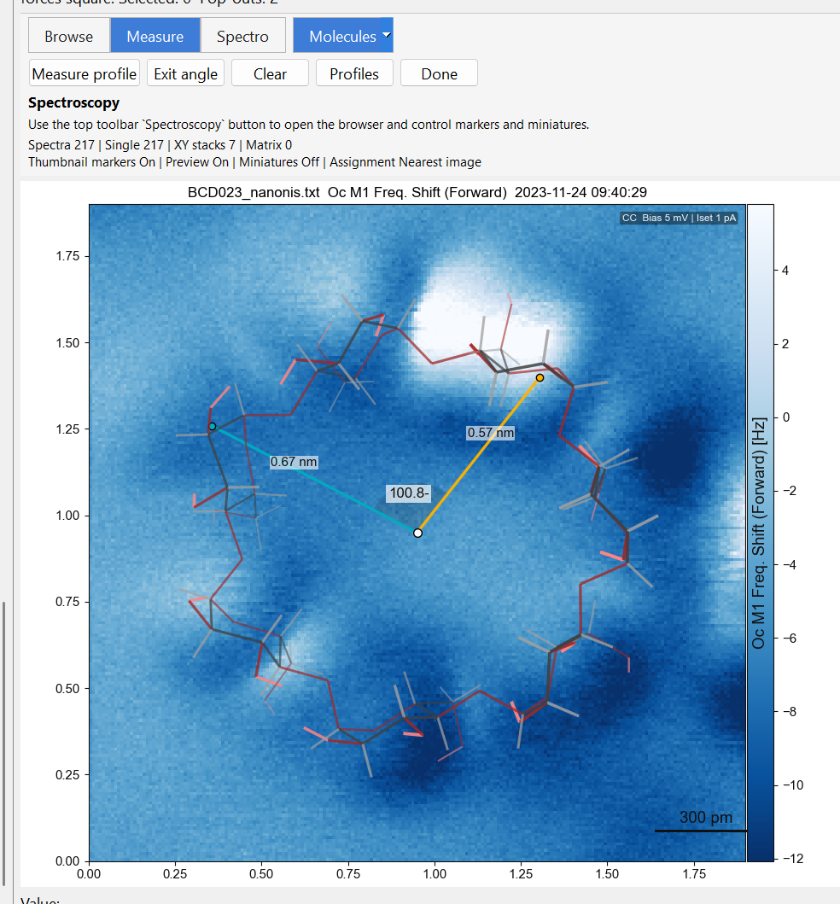

# Angle Measurements

SXM Viewer supports angle overlays directly on the image canvas, alongside the profile tools.

{ width="900" }

---

## Creating an angle measurement

Hold ++ctrl++ and ++alt++, then click on the preview or a pop-out to create a new angle measurement frame.

Angle overlays behave like other canvas measurements: they stay visible while active and can be managed separately from saved overlays.

---

## Working with angle overlays

Typical actions include:

- creating a new angle on the preview or a pop-out
- adjusting the measurement graphically on the image
- saving the result as an overlay for later recall
- toggling saved angle overlays with ++ctrl+2++

Angle overlays participate in the same session and collection workflows as other analysis state.

---

## Saved vs active overlays

Like profiles, angle measurements distinguish between:

- the **live active measurement** you are currently editing, and
- **saved overlays** that persist as part of the image state

The saved-overlay toggle controls the saved items only; active measurements remain visible while the tool is in use.

---

## Where angle state is preserved

Angle overlays are preserved in:

- sessions
- collections
- popup and preview canvas state
- virtual copies derived from analysed views

See [Sessions & Collections](../browsing/sessions-and-collections.md).

---

## Related tools

- [Profiles & Measurements](profiles.md)
- [Cropping](cropping.md)
- [Overlays](../workspace/overlays.md)
