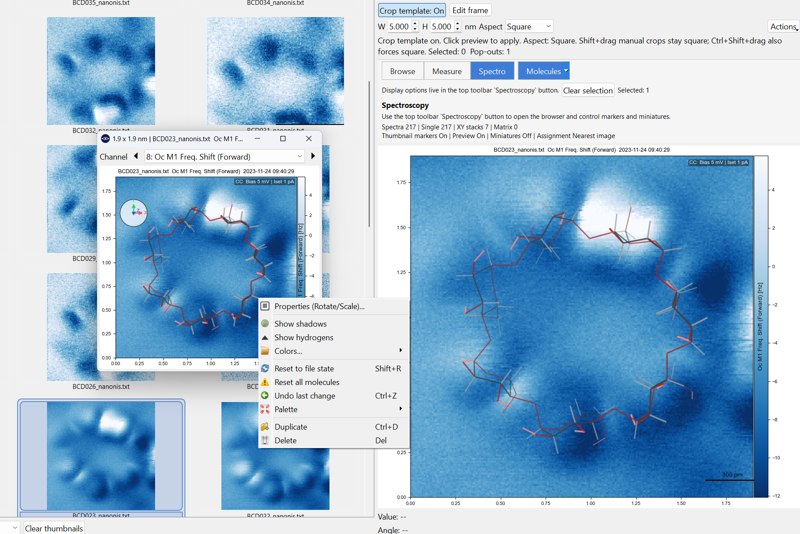

# Molecule Overlays

Molecule overlays let you place and manipulate molecular models directly on preview canvases, pop-outs, and canvas tiles.

{ width="900" }

---

## Showing molecules

Molecule overlays can be toggled from the main lower workspace row, from **Display**, and from right-click menus. They are part of the normal overlay system and can be shown or hidden without reloading the underlying image.

Saved molecule state is preserved with sessions and other workspace snapshots.

---

## Loading a molecule

Use the **Molecules** control in the lower workspace row to toggle overlays or open the molecule menu. The same actions are also available from canvas right-click menus.

Typical actions include:

- show or hide molecules
- load a molecule file
- load a recent molecule
- clear molecules from the current image

On normal preview and pop-out canvases, molecule visibility is part of the shared display-state system.

---

## Selecting and rotating molecules

Once a molecule is selected:

| Shortcut or gesture | Action |
|---|---|
| Click molecule | Select molecule |
| ++x++ | Rotate around X |
| ++y++ | Rotate around Y |
| ++z++ | Rotate around Z |
| ++shift+x++ / ++shift+y++ / ++shift+z++ | Rotate in the opposite direction |
| ++shift++ + drag | Rotate around Z |
| ++ctrl++ + ++shift++ + drag | Rotate in X/Y |
| Middle-button drag | Rotate in X/Y |

---

## Molecule gizmo

The molecule gizmo is a small orientation widget for the selected molecule.

{ width="700" }

- It appears temporarily when you select, move, or rotate a molecule.
- It can be kept visible through **Display -> Show Molecule Gizmo**.
- It follows the current X/Y/Z rotation state of the active molecule.

The gizmo is also interactive:

- dragging the inner area rotates the molecule in **X/Y**
- dragging the outer ring rotates the molecule around **Z**

{ width="900" }

---

## Reset to file state

If you want to discard molecule edits and return to the original file-derived orientation and properties:

- right-click the selected molecule -> **Reset to file state**
- or press ++shift+r++

This reloads the molecule from its source file and clears overlay edits such as rotation or appearance overrides, while keeping the current on-canvas placement.

---

## Overlay behavior

Molecule overlays are tied to the current image state rather than being a purely global decoration. In particular:

- preview and pop-outs can show or hide them through display state
- virtual copies default to their own molecule state
- sessions can preserve molecule overlays
- copy and clear actions exist for thumbnail and canvas workflows

---

## Default appearance

New overlays start in a bond-only display mode with the PyMol palette selected by default.

---

## Related pages

- [Overlays](../workspace/overlays.md)
- [Publication Canvas](../workspace/canvas.md)
- [Sessions & Collections](../browsing/sessions-and-collections.md)
