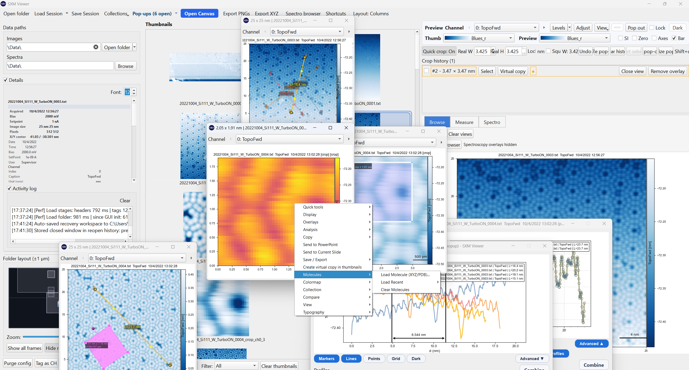
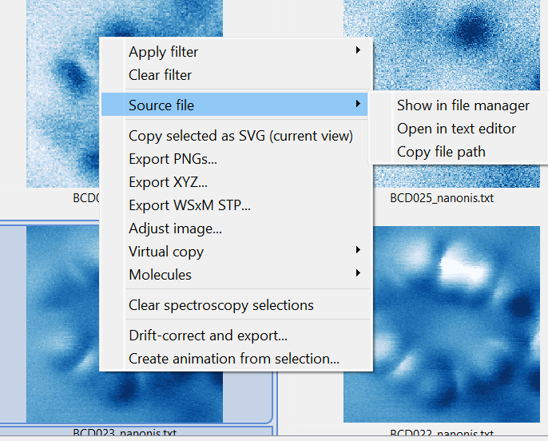

# Preview & Pop-out Windows

{ width="1100" }

## The main preview

Clicking a thumbnail loads it into the **main preview** pane. The preview shows the full image with colormap, colorbar, scale bar, and any active overlays. A metadata panel alongside it shows acquisition parameters in correctly scaled SI units.

### Switching channels

Use the **channel selector** at the top of the preview area, or the previous and next channel arrows, to switch between simultaneously acquired channels such as topography, current, and KPFM.

The preview header is intentionally channel-first: the channel selector remains the primary persistent control, while lower-frequency actions are grouped into the top-level **Image**, **Display**, and **Tools** menus.

### Relative-zero display

Press ++0++ or use **Display -> Values relative to zero** to shift the colorbar so it starts at zero. This is useful for constant-height images where absolute z values matter. Auto-contrast and range resets respect this constraint.

### Relative axes

Enable **Display -> Relative axes** to display image axes starting from zero in physical units instead of absolute piezo coordinates.

### Acquisition HUD

Enable **Display -> Show acquisition overlay** to add a top-right HUD showing:

- **CC images**: bias and setpoint current
- **CH images**: absolute z position

---

## Pop-out windows

Double-click any thumbnail to open it as a floating pop-out window. Pop-outs are independent views with their own channel selector, contrast state, overlays, and analysis state.

{ width="900" }

### Creating pop-outs from the preview

Right-click the preview canvas -> **Pop out** to open the current view as a floating window.

### What pop-outs support

- independent channel switching
- all overlay types: profiles, angles, molecules, scale bar, acquisition HUD
- local relative-zero toggle
- crop-template and manual crop workflows
- profile-measurement dialogs
- **Apply this style to all pop-ups** to copy font scale, typography, and display layout from the active popup to the others

### Managing pop-outs

| Action | How |
|---|---|
| Bring all to front | ++ctrl+shift+p++ or toolbar **Pop-ups** menu |
| Minimize all | ++ctrl+shift+m++ |
| Arrange or tile | **Pop-ups** toolbar split-button -> Arrange |
| Close all | **Pop-ups** toolbar menu -> Close all |
| Reopen last closed | ++ctrl+z++ when nothing else is available to undo |

The **Pop-ups** toolbar button is a split button: primary click recalls open pop-outs, while the menu gives per-window focus, arrange, minimize, and restore actions.

### Popup size badge

Pop-outs show the physical scan dimensions, or pixel dimensions as fallback, in the window title bar.

### Source-file actions

Right-clicking the preview or a pop-out exposes a **Source file** submenu so you can:

- reveal the underlying file in the OS file manager
- open the underlying file in the default text editor
- copy the full file path

{ width="700" }

---

## Display options that sync across windows

Many display settings propagate automatically between the main preview and open pop-outs:

- ticks, colorbar visibility, and colorbar orientation
- title, acquisition HUD, and shortcut hint
- profile and angle overlay visibility
- molecules and scale bar
- frame fill mode
- relative axes override
- layout mode
- dark and light presentation state for the canvas background
