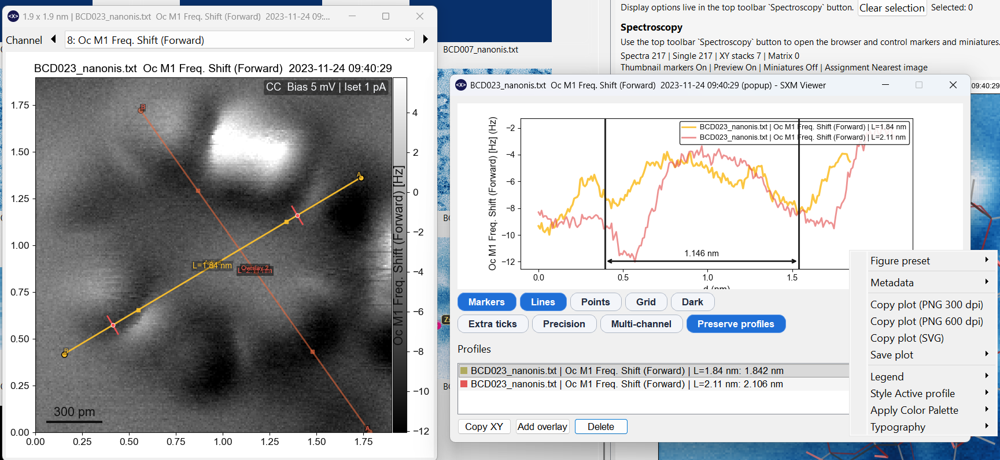

# Profiles & Measurements

## Drawing a profile

{ width="900" }

Hold ++ctrl++ and click on the preview or any pop-out to start a new profile line. Drag to set the endpoint and release. The **Profile measurement** dialog opens automatically with the extracted line profile.

Plain click does **not** start a profile — it only selects. This prevents accidental profile creation during normal navigation.

After creating a profile you enter a **move-only** state: you can drag the existing profile line and endpoints freely, but a new profile still requires holding ++ctrl++ and clicking.

---

## Profile measurement dialog

The dialog shows the profile plot with controls arranged as compact pill toggles:

**Primary toggles** (always visible):

| Toggle | Shortcut | Effect |
|---|---|---|
| Markers | ++v++ | Show/hide data point markers |
| Lines | ++l++ | Show/hide connecting lines |
| Points | ++p++ | Show/hide individual data points |
| Grid | ++g++ | Toggle grid lines |
| Dark | — | Toggle dark theme for the plot |

**Advanced toggles** (press ++a++ to show):

| Toggle | Shortcut | Effect |
|---|---|---|
| Extra ticks | ++t++ | Additional tick marks |
| Precision | ++r++ | Higher-precision axis labels |
| Multi-channel | ++m++ | Show profiles from all channels simultaneously |
| Preserve profiles | — | Keep profiles when switching images |

---

## Saved profiles (overlays)

A profile remains **active** while the tool is armed. You can **save** it as a permanent overlay that persists across channel switches and image navigation:

Right-click the profile line or the profile list → **Save as overlay**.

Saved profiles appear as overlays on the canvas and as entries in the profile list. Use ++ctrl+1++ to toggle their visibility.

### Styling overlays

Right-click a saved profile in the list or on the plot to access styling options:

- Color picker
- Line thickness
- Line style (solid, dashed, dotted)
- Marker shape and size
- Apply a palette to multiple profiles

Style changes propagate immediately to the canvas overlay.

### Deleting overlays

Select an entry in the profile list and press ++delete++ or ++backspace++.

---

## Angle and distance measurements

Within the profile measurement dialog, you can also measure **angles** and **distances** between points annotated on the profile plot. See [Angle Measurements](angles.md) for the dedicated angle tool on the image canvas.

---

## Multi-channel profiles

Enable **Multi-channel** (++m++) to extract and overlay profiles from all simultaneously acquired channels in a single plot. Each channel is plotted with a distinct colour.

---

## Composite profiles

You can merge profiles from multiple images or pop-outs into a single **composite profile dialog**:

1. Open profile dialogs on two or more windows.
2. Drag the profile-set handle from one profile window onto another.
3. A new composite dialog opens, combining the curve sets.

Source-aware curve labels distinguish which image each profile came from. You can delete individual curves in the composite without affecting the originals.

---

## Publication figure size presets

The profile plot metadata menu includes figure size presets that resize the dialog and canvas to match physical journal dimensions:

- Journal 1-col square (88 mm)
- Journal 1-col square (85 mm)
- Slides square (127 mm)

---

## Copying profile plots

Right-click the profile plot surface → **Copy as PNG** or **Copy as SVG**.

---

## Profiles in pop-outs and sessions

- Profiles created in the main preview are **not** inherited by pop-outs (and vice versa) unless explicitly saved.
- Profile measurement dialogs are **detached** from the main-window stacking order so interacting with them does not push image pop-outs behind the main GUI.
- Sessions save and restore all profile state including profile measurement window geometry.
