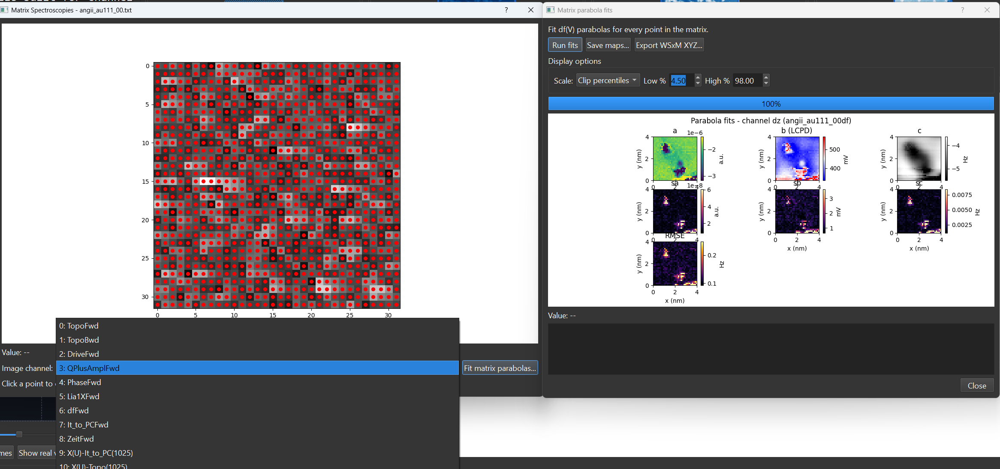

# Matrix Scans

SXM Viewer supports MATRIX spectroscopy data and can reconstruct matrix-style spectroscopy grids from the underlying coordinate data.

{ width="900" }

---

## What a matrix scan is

A matrix scan stores spectroscopy traces sampled across a spatial grid rather than at a single point. In SXM Viewer, those datasets are treated as part of the same spectroscopy workspace as single-point traces.

---

## In the main workspace

Matrix datasets can appear as:

- associated spectroscopy entries in the browsing workflow
- matrix footprints or grid overlays on images
- data opened through the same spectroscopy popup infrastructure

Recent work in the project history improved matrix footprint visibility, tooltips, and parser robustness.

---

## Overlay and browsing behavior

When matrix overlays are enabled, the image can show a visible footprint for the acquisition region. Tooltips can expose the grid dimensions directly in the browsing workflow.

Matrix parsing has also been hardened so malformed inputs are rejected more clearly instead of silently producing misleading associations.

---

## Edge cases

Single-point datasets that travel through the matrix path are handled explicitly, so a 1×1 case can still be represented cleanly.

---

## Related pages

- [Spectroscopy Overview](overview.md)
- [Spectroscopy Browser](browser.md)
- [Supported File Formats](../reference/file-formats.md)
