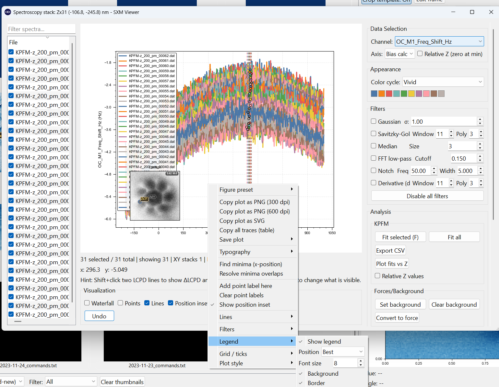
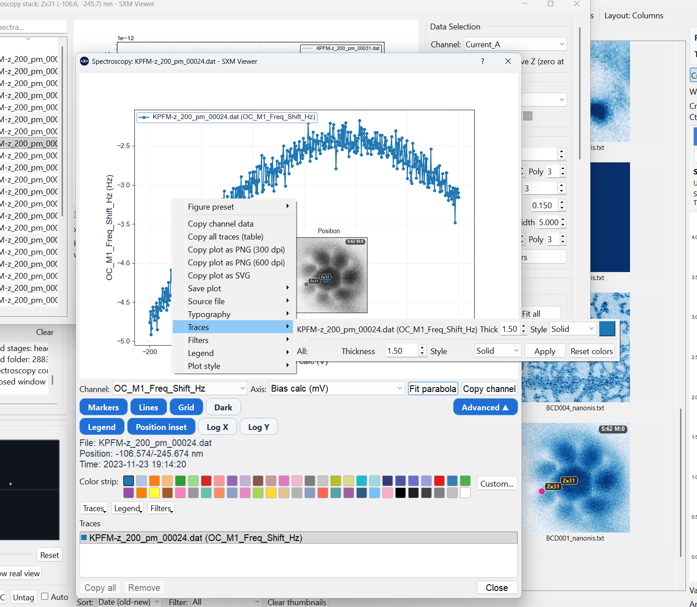
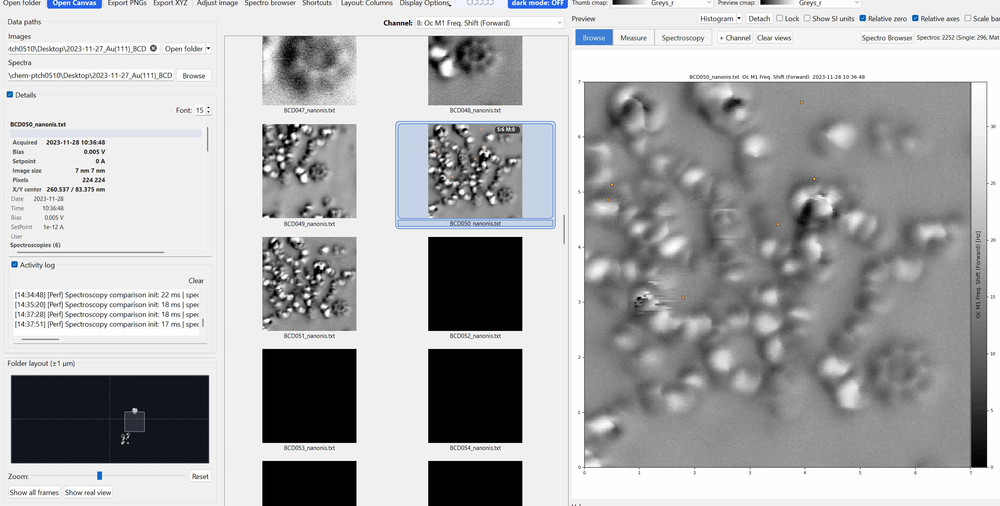

# Spectroscopy Overview

SXM Viewer loads spectroscopy files automatically when a folder is opened, associating them with images using robust timestamp-based matching. Spectroscopy data and scan images live in the same workspace rather than requiring separate tools.

{ width="900" }

---

## Spectroscopy thumbnails

Associated spectroscopy files appear as **miniature thumbnails** within the main thumbnail grid, positioned near their spatially associated scan image. Markers on the scan thumbnails indicate where each spectroscopy was acquired.

### Thumbnail marker customisation

Right-click a spectroscopy thumbnail -> **Miniature channel** to choose which channel drives the miniature plot. Marker size, colour, and symbol are also customisable for better visibility on different backgrounds.

### Selection

| Gesture | Effect |
|---|---|
| Single click | Select spectroscopy |
| Shift+Click | Range-select |
| Ctrl+Click | Add or remove from selection |
| Drag | Rubber-band selection |
| Double-click | Open spectroscopy popup |

---

## Spectroscopy browser

Open the **Spectroscopy Browser** from the toolbar. It presents all associated spectroscopy files as a multi-column table with sortable columns. From the browser you can:

- select single or multiple spectroscopies
- open them in the spectroscopy popup
- reuse the same popup while appending more traces
- apply a channel preset to selected entries

---

## Spectroscopy popup

The spectroscopy popup uses the same general layout style as the profile-measurement window: plot on top, control strip underneath, advanced controls on demand, and a trace list below.

It can display one spectrum or several overlaid traces in the same window.

{ width="900" }

{ width="900" }

### Core controls

The main popup keeps the high-frequency controls visible:

- **Channel**
- **Axis**
- **Fit parabola**
- **Copy channel**
- toggles for **Markers**, **Lines**, **Grid**, and **Dark**

### Advanced controls

The **Advanced** section exposes:

- **Legend** toggle
- **Position inset**
- **Log X / Log Y**
- colour swatches for the active trace
- menus for **Traces**, **Legend**, and **Filters**

### Trace styling

The popup supports per-trace visual editing without needing the full comparison dialog:

- change trace colour
- change line thickness
- change line style
- apply a style to all traces
- reset trace colours to the active palette

The trace list also supports right-click styling for the currently selected trace.

### Legend editing

The popup legend supports:

- show or hide
- position
- font size
- background on or off
- border on or off

### Filters

Single-spectrum popups can now apply the same core signal-processing stack used in the comparison workflow:

- Gaussian smoothing
- Savitzky-Golay smoothing
- Median filtering
- FFT low-pass
- Notch filtering
- first derivative `dY/dX`

These are display and analysis filters for the plotted traces; they do not rewrite the source file.

### Typography and export

Font family, bold, italic, and underline are accessible from the right-click **Typography** menu and stay consistent with the rest of the GUI.

Right-click the spectroscopy plot for:

- PNG, SVG, and PDF export
- direct data-copy actions
- trace styling
- legend editing
- source-file actions

---

## Source-file actions

Both spectroscopy thumbnails and spectroscopy popups expose a **Source file** submenu so you can:

- show the underlying file in the operating-system file manager
- open the file in the default text editor for the current OS
- copy the full file path

---

## Spatial markers on images

When spectroscopy display is enabled, markers appear on the preview and pop-outs at the acquisition positions. Toggling spectroscopy on or off does not reload the data; the association is cached.

Marker positions are correctly placed in both absolute and relative axes display modes.

---

## Supported spectroscopy types

- Single-point I(V), I(z), df(V), df(z) traces
- Grid or matrix spectroscopy (see [Matrix Scans](matrix.md))
- KPFM data (see [KPFM](kpfm.md))
- Parabola fits (see [Parabola Fits](parabolas.md))
- WSxM XYZ export
